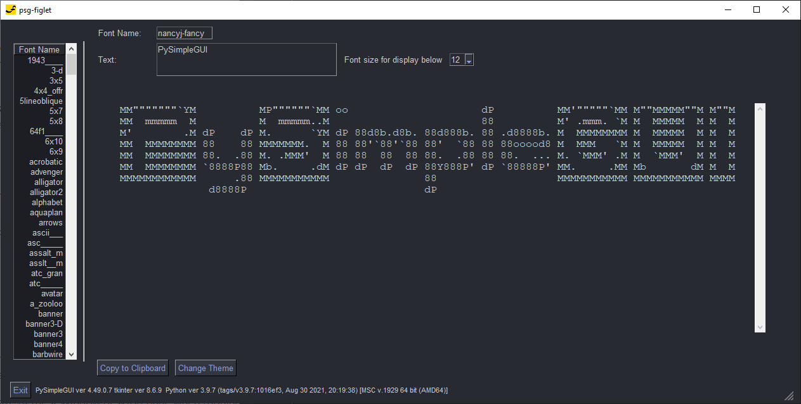

<p align="center">
  <p align="center"><p>

  <h2 align="center">psgfiglet</h2>
  <h2 align="center">A PySimpleGUI Application</h2>
</p>

Create Figlets

```text
  ______ _       _      _
 |  ____(_)     | |    | |
 | |__   _  __ _| | ___| |_ ___
 |  __| | |/ _` | |/ _ \ __/ __|
 | |    | | (_| | |  __/ |_\__ \
 |_|    |_|\__, |_|\___|\__|___/
            __/ |
           |___/
```
```text
  _               ___       __  _                 _        ___        _____
 | |__  _   _    / _ \_   _/ _\(_)_ __ ___  _ __ | | ___  / _ \/\ /\  \_   \
 | '_ \| | | |  / /_)/ | | \ \ | | '_ ` _ \| '_ \| |/ _ \/ /_\/ / \ \  / /\/
 | |_) | |_| | / ___/| |_| |\ \| | | | | | | |_) | |  __/ /_\\\ \_/ /\/ /_
 |_.__/ \__, | \/     \__, \__/|_|_| |_| |_| .__/|_|\___\____/ \___/\____/
        |___/         |___/                |_|
```


<p align="center"><p>


## Features

* Retro ASCII ART
* Create big block letters composed of smaller characters
* Choose from dozens of fonts
* Copy and paste into your documents and code


## Installation

### Using PIP with PyPI

The latest official release of PySimpleGUI products can be found on PyPI.  To pip install the demo applications from PyPI, use this command

#### If you use the command `python` on your computer to invoke Python (Windows):

`pip install --upgrade psgfiglet`

#### If you use the command `python3` on your computer to invoke Python (Linux, Mac):

`pip3 install --upgrade psgfiglet`

### Using PIP with GitHub

You can also pip install the PySimpleGUI Applications that are in the PySimpleGUI GitHub account.  The GitHub versions have bug fixes and new programs/features that have not yet been released to PyPI. To directly pip install from that repo:

#### If you use the command `python` on your computer to invoke Python (Windows):

```bash
python -m pip install --upgrade https://github.com/PySimpleGUI/psgfiglet/zipball/main
```

#### If you use the command `python3` on your computer to invoke Python (Linux, Mac):

```bash
python3 -m pip install --upgrade https://github.com/PySimpleGUI/psgfiglet/zipball/main
```


## Usage

Once installed, launch psgfiglet by typing the following in your command line:

`psgfiglet`

## About - What is a Figlet?

A Figlet is a text based way to add large block text to your code or chats.  There are a variety of "Fonts" available that you'll find listed along the left side of the screen.


## To use in your code

The easiest way to is make a multiline string in your code using triple quotes:

```python

'''
This is a multiline string
Line 2
'''
```


You can simply paste your Figlet into one of these multiline comments.  They work well at breaking up your code into chunks

```python

'''
                    oo          
                                
88d8b.d8b. .d8888b. dP 88d888b. 
88'`88'`88 88'  `88 88 88'  `88 
88  88  88 88.  .88 88 88    88 
dP  dP  dP `88888P8 dP dP    dP
'''

def main():
    x = 20

```

## License & Copyright

Copyright 2023-2024 PySimpleSoft, Inc. and/or its licensors.

This is a free-to-use "Utility" and is licensed under the
PySimpleGUI License Agreement, a copy of which is included in the
license.txt file and also available at https://pysimplegui.com/eula.

Please see Section 1.2 of the license regarding the use of this Utility,
and see https://pysimplegui.com/faq for any questions.


## Contributing

We are happy to receive issues describing bug reports and feature
requests! If your bug report relates to a security vulnerability,
please do not file a public issue, and please instead reach out to us
at issues@PySimpleGUI.com.

We do not accept (and do not wish to receive) contributions of
user-created or third-party code, including patches, pull requests, or
code snippets incorporated into submitted issues. Please do not send
us any such code! Bug reports and feature requests should not include
any source code.

If you nonetheless submit any user-created or third-party code to us,
(1) you assign to us all rights and title in or relating to the code;
and (2) to the extent any such assignment is not fully effective, you
hereby grant to us a royalty-free, perpetual, irrevocable, worldwide,
unlimited, sublicensable, transferrable license under all intellectual
property rights embodied therein or relating thereto, to exploit the
code in any manner we choose, including to incorporate the code into
PySimpleGUI and to redistribute it under any terms at our discretion.
